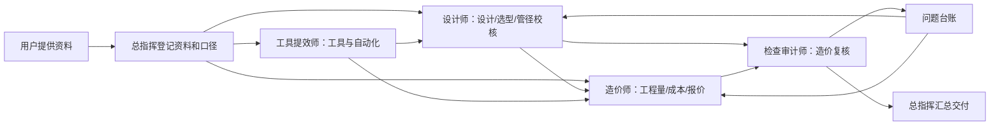

# 多Agent工作团队SOP

## 1. 团队目标

面向多联机空调项目，形成从图纸设计到报价闭环的一套协作团队：

- 完成图纸设计与设计校核。
- 完成产品选型、冷媒管规格校核、分歧管和主机匹配。
- 完成工程量统计、成本测算、报价输出。
- 对接飞书库存表，优先使用库存可供货型号进行选型报价。
- 建立检查审计机制，复核设计、工程量、成本和报价错误。
- 持续寻找自动化工具，提高效率和准确率。

## 2. 团队角色

| 角色 | 定位 | 主要职责 | 主要交付物 |
| --- | --- | --- | --- |
| 总指挥 | 项目经理 / 调度中枢 | 拆任务、定口径、收敛争议、汇总交付 | 项目任务书、派工单、最终汇总报告 |
| 设计师 | 设计与选型负责人 | 图纸设计、设备选型、管径校核、系统匹配 | 设计图纸、选型表、管径校核表 |
| 造价师 | 工程量与成本负责人 | 工程量统计、材料核价、成本分析、报价 | 工程量清单、成本表、报价表 |
| 检查审计师 | 质量与风险负责人 | 查日志、复核公式、抽查图纸与报价、问题闭环 | 审计清单、问题台账、复核报告 |
| 工具提效师 | 自动化与工具负责人 | 工具搜索、流程自动化、数据接口、效率提升 | 工具方案、自动化脚本建议、数据接口说明 |

## 3. 总指挥工作流

### 阶段 A：资料接收

总指挥接收并登记资料：

- 图纸文件：DWG、DXF、PDF、DWFx、截图。
- 设计标准：品牌多联机冷媒管规格标准、分歧管标准、冷媒追加规则。
- 设备表：室内机型号、容量、数量、安装位置；室外机型号、组合容量。
- 库存表：飞书库存表、Excel 导出、CSV 导出或截图。
- 商务参数：材料单价、人工费、损耗率、税率、管理费、利润率。

### 阶段 B：设计校核

设计师负责：

- 读取设备表和设计标准。
- 按系统编号建立内外机关系。
- 按下游容量校核每段冷媒管管径。
- 校核分歧管型号、管长限制、落差限制和追加冷媒量。
- 输出设计校核表。

### 阶段 C：工程量与成本

造价师负责：

- 从图纸或底稿提取铜管、保温、冷凝水管、线缆、风口、分歧管、冷媒等工程量。
- 与设计校核表核对规格是否一致。
- 按库存表和价格表匹配材料单价。
- 生成成本分析和报价。

### 阶段 D：审计复核

检查审计师负责：

- 复核图纸量、表格量、公式、单位换算和规格映射。
- 抽查关键系统和异常差异。
- 查执行日志，确认数据来源、版本、计算口径。
- 输出问题台账，要求责任角色闭环修正。

### 阶段 E：工具提效

工具提效师负责：

- 评估是否能用 CAD/DXF 工具直接抽取图元和文字。
- 评估 PDF/OCR/Excel/飞书表格自动化方案。
- 建立可复用脚本和模板。
- 记录工具局限和人工复核点。

## 4. 标准数据流

## 5. 核心表格模板

### 5.1 资料登记表

| 字段 | 说明 |
| --- | --- |
| 资料编号 | 如 SRC-001 |
| 文件名 / 链接 | 本地文件名或飞书链接 |
| 资料类型 | 图纸、标准、设备表、库存表、价格表 |
| 版本日期 | 文件版本或接收日期 |
| 责任角色 | 设计师、造价师、审计师等 |
| 使用状态 | 已使用、待确认、作废 |
| 备注 | 口径说明 |

### 5.2 管径设计校核表

| 字段 | 说明 |
| --- | --- |
| 系统编号 | 如 SYS-01 |
| 管段编号 | 如 P-01 |
| 起点 | 室外机、分歧管、室内机 |
| 终点 | 分歧管、室内机 |
| 下游室内机 | 下游设备编号列表 |
| 下游容量合计 | kW 或 HP |
| 标准应选液管 | 依据设计标准 |
| 标准应选气管 | 依据设计标准 |
| 图纸液管 | 图纸标注 |
| 图纸气管 | 图纸标注 |
| 结论 | 正确、偏小、偏大、待确认 |
| 依据 | 标准表行号或条文 |

### 5.3 工程量核对表

| 字段 | 说明 |
| --- | --- |
| 项目 | 铜管、保温、冷媒、线缆、排水管 |
| 规格 | φ9.52、φ15.88 等 |
| 图纸量 | 从图纸或底稿统计 |
| 表格量 | 施工任务单或报价表数量 |
| 单位 | m、根、kg、套 |
| 换算口径 | 如保温 2m/根 |
| 差异 | 表格量 - 图纸量 |
| 结论 | 一致、表格多、表格少 |
| 责任角色 | 设计师或造价师 |
| 备注 | 异常说明 |

### 5.4 成本与报价表

| 字段 | 说明 |
| --- | --- |
| 材料类别 | 铜管、保温、冷媒、分歧管等 |
| 规格型号 | 与库存表匹配的型号 |
| 工程量 | 核定数量 |
| 库存可用量 | 来自飞书库存表 |
| 采购建议 | 库存优先、需采购、替代型号 |
| 单价 | 库存价或采购价 |
| 材料成本 | 工程量 * 单价 |
| 人工/辅材 | 按规则计取 |
| 合价 | 成本汇总 |
| 报价 | 含管理费、利润、税费 |

### 5.5 问题台账

| 字段 | 说明 |
| --- | --- |
| 问题编号 | QA-001 |
| 严重性 | P0/P1/P2/P3 |
| 来源 | 设计、造价、报价、工具 |
| 问题描述 | 简明说明 |
| 影响范围 | 系统、管段、材料项 |
| 责任人 | 对应角色 |
| 修正建议 | 审计师给出 |
| 状态 | 待处理、处理中、已修复、已复核 |
| 复核结论 | 通过/不通过 |

## 6. 角色协作规则

- 总指挥只定口径和整合结果，不直接覆盖角色结论。
- 设计师的管径校核是造价师统计规格的依据。
- 造价师不能自行改设计规格；发现不一致时提交问题台账。
- 检查审计师不负责重做全部工作，只做抽查、公式检查和异常追踪。
- 工具提效师不能以工具结果替代审计结论，必须保留人工复核点。
- 所有关键结论必须可追溯到资料编号、单元格、图纸标注或标准条文。

## 7. 后续启动方式

当用户提供资料后，总指挥按以下顺序派工：

1. 设计师读取标准、设备表和图纸，输出设计校核表。
2. 造价师读取图纸量和库存表，输出工程量及成本报价。
3. 检查审计师复核设计校核表、工程量表、成本报价表。
4. 工具提效师评估当前资料能否自动抽取，提出效率提升方案。
5. 总指挥合并所有结果，生成最终交付文件。

## 8. 配套文件

本团队方案配套两个文件：

| 文件 | 用途 |
| --- | --- |
| `多Agent岗位SOP细则.md` | 记录设计师、造价师、检查审计师、工具提效师的详细岗位SOP |
| `多Agent角色提示词模板.md` | 用于后续快速启动子Agent或复制到新线程执行 |

后续项目执行时，总指挥先读取本文件确定流程，再读取岗位SOP分派任务，最后使用角色提示词模板启动对应Agent。
